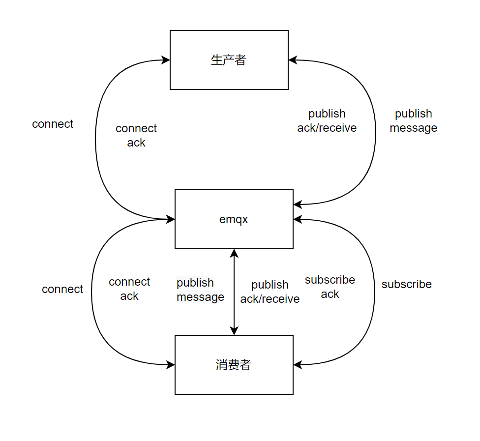
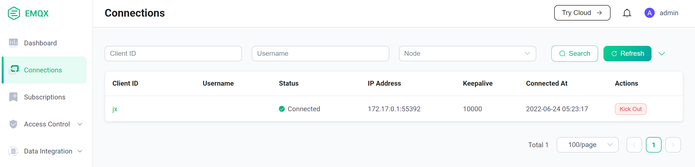
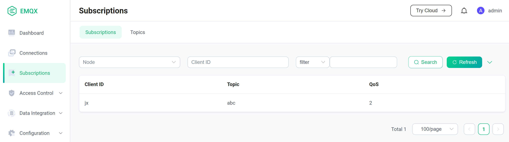
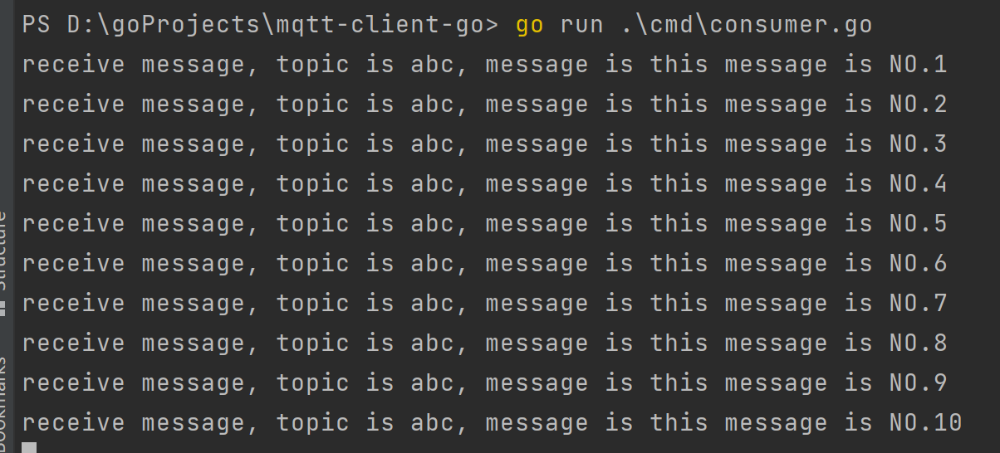

# mqtt-client-go

为了学习mqtt协议，使用Golang封装的mqtt5.0客户端，仅学习使用

因协议复杂时间有限，目前只实现简单的connect、sub、pub功能

## 部署mqtt server

使用emq开源的[emqx](https://github.com/emqx/emqx)作为服务端

为部署方便，使用docker启动

```
docker run -d --name emqx -p 1883:1883 -p 8081:8081 -p 8083:8083 -p 8883:8883 -p 8084:8084 -p 18083:18083 emqx/emqx
```

18083端口为内置dashboard服务

1883端口为emqx服务

## 生产消费流程



## 消费者

```
go run cmd/consumer.go
```

启动的消费者订阅了名为abc的topic

查看emqx dashboard，已经有了对应的消费者连接和订阅信息，说明消费者启动成功





## 生产者

```
go run cmd/producer.go
```

生产者会生产10条topic为abc的消息

查看消费者端，发现已经有消息打印出来了



## 结构体说明

| 名称                  | 含义               |
| --------------------- | ------------------ |
| ConnectMessage        | 构建连接消息体     |
| SubscribeMessage      | 构建订阅消息体     |
| PublishMessage        | 构建发布消息体     |
| PublishReceiveMessage | 构建发布接收消息体 |

